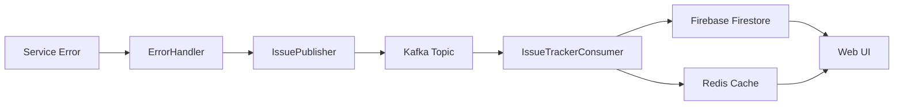
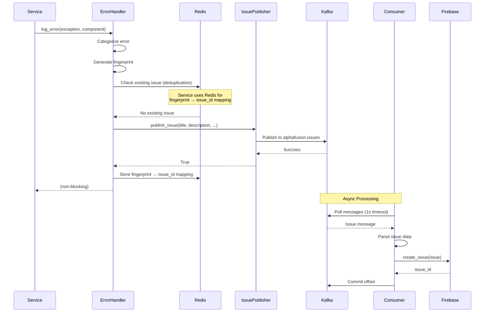
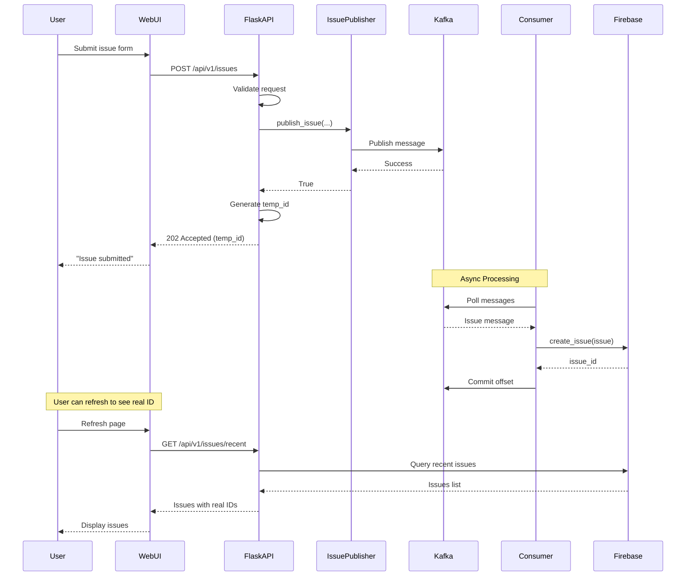
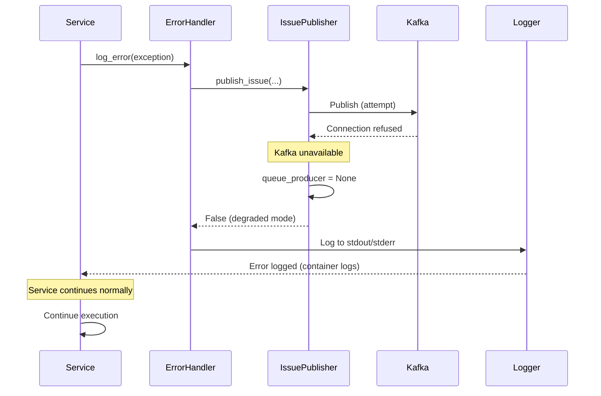
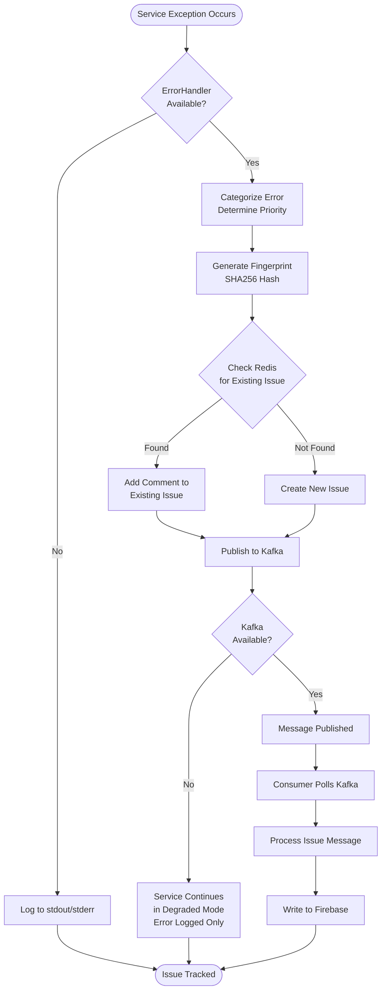
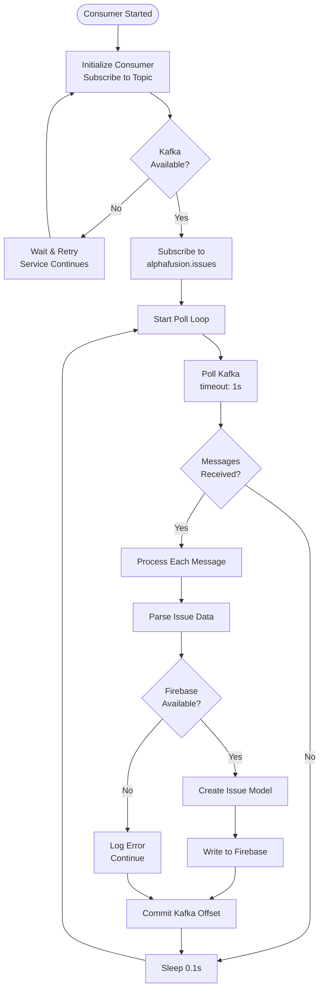
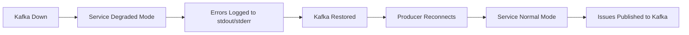
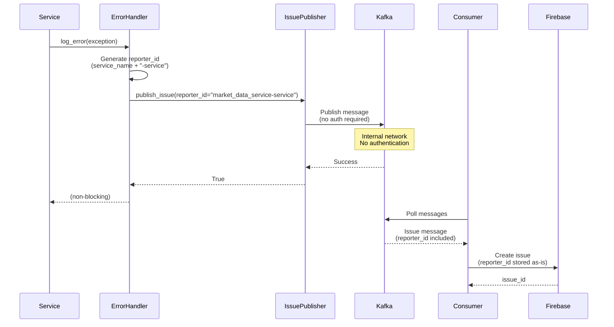
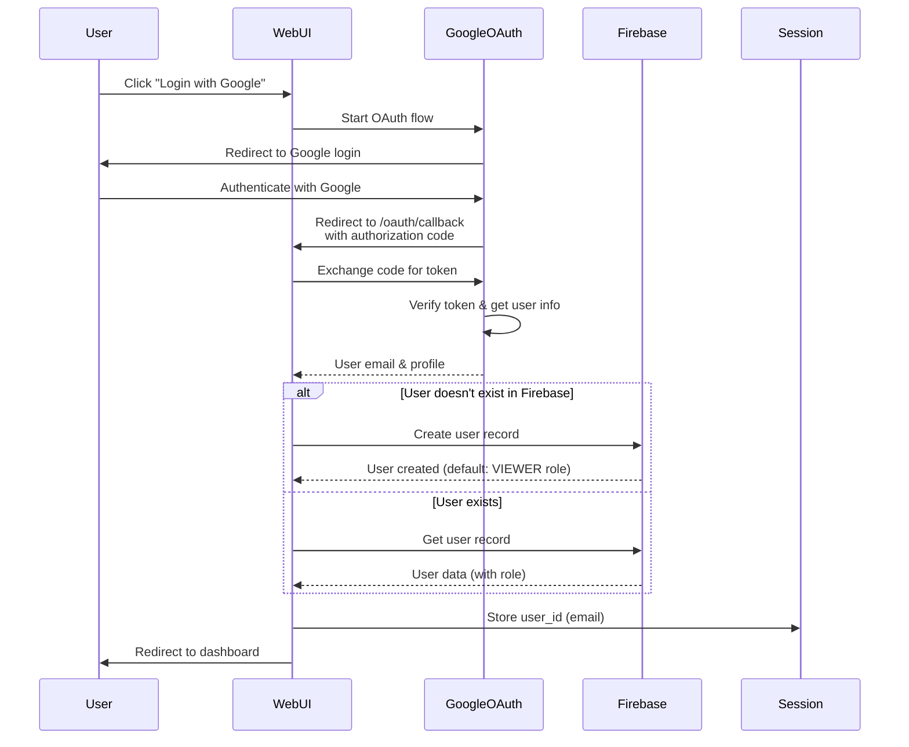

# Issue Tracking System Architecture

## Table of Contents
1. [Overview](#overview)
2. [Component Diagram](#component-diagram)
3. [Data Flow](#data-flow)
4. [Sequence Diagrams](#sequence-diagrams)
5. [Dependencies](#dependencies)
6. [Workflow](#workflow)
7. [Error Handling & Degraded Mode](#error-handling--degraded-mode)

---

## Overview

The Issue Tracking System is a distributed, event-driven architecture that enables all AlphaFusion services and applications to report errors and issues. The system uses Kafka as the message broker for asynchronous issue publishing, ensuring non-blocking error reporting and high availability.

### Key Principles
- **Event-Driven**: All issues flow through Kafka for decoupling
- **Non-Blocking**: Services never block on issue reporting
- **Degraded Mode**: Services continue operating when Kafka is unavailable
- **Single Source of Truth**: Firebase Firestore is the authoritative data store
- **Dependency Injection**: All components use DI patterns for testability

### Architecture Pattern
- **Publisher-Subscriber**: Services publish issues to Kafka, IssueTracker consumes and processes
- **Provider Pattern**: Firebase and Redis providers abstract storage implementations
- **Factory Pattern**: Queue producers/consumers created via factories

---

## Component Diagram

```mermaid
flowchart TB
    subgraph "AlphaFusion Services"
        S1[Background Services<br/>MarketData, Liquidation, etc.]
        S2[Newsfeed Service]
        S3[Socialfeed Service]
        S4[DataEnrich Service]
        S5[CLI App]
        S6[Tradedesk Web App]
        S7[Workflow Services]
    end

    subgraph "Error Reporting Layer"
        EH1[ErrorHandler]
        EH2[ErrorHandler]
        EH3[ErrorHandler]
        IP[IssuePublisher<br/>Singleton]
    end

    subgraph "Message Queue"
        K[Kafka<br/>Topic: alphafusion.issues]
    end

    subgraph "Issue Tracker Service"
        API[Flask API<br/>/api/v1/issues]
        IC[IssueTrackerConsumer<br/>Background Thread]
        FP[FirebaseHelperProvider]
    end

    subgraph "Data Storage"
        FB[(Firebase Firestore<br/>issues/{id})]
        RD[(Redis Cache<br/>Service Deduplication<br/>Only)]
    end

    subgraph "Web UI"
        UI[Issue Tracker Dashboard<br/>Flask Web App]
    end

    S1 --> EH1
    S2 --> EH2
    S3 --> EH2
    S4 --> EH3
    S5 --> EH1
    S6 --> EH1
    S7 --> EH1

    EH1 --> IP
    EH2 --> IP
    EH3 --> IP

    IP --> K
    API --> IP
    IP --> K

    K --> IC
    IC --> FP
    IC --> RP

    FP --> FB
    RP --> RD

    UI --> API
    UI --> FB
    UI --> RD

    style K fill:#f9f,stroke:#333,stroke-width:4px
    style FB fill:#bbf,stroke:#333,stroke-width:2px
    style RD fill:#fbb,stroke:#333,stroke-width:2px
    style IP fill:#bfb,stroke:#333,stroke-width:2px
```

### Component Descriptions

#### 1. **Services Layer**
- **Background Services**: MarketDataService, LiquidationService, FundingRateService, etc.
- **Microservices**: Newsfeed, Socialfeed, DataEnrich
- **Applications**: CLI App, Tradedesk Web App
- **Workflow Services**: WorkflowProcessor, RealTimeTradingWorkflow

All services use `ErrorHandler` for error reporting, which internally uses `IssuePublisher`.

#### 2. **Error Reporting Layer**
- **ErrorHandler**: Centralized error handling with deduplication, categorization, and fingerprinting
- **IssuePublisher**: Singleton publisher that publishes issues to Kafka topic `alphafusion.issues`

#### 3. **Message Queue**
- **Kafka**: Topic `alphafusion.issues` for asynchronous issue publishing
- **Consumer Group**: `issuetracker-consumer`

#### 4. **Issue Tracker Service**
- **Flask API**: REST API endpoint `/api/v1/issues` for direct issue creation
- **IssueTrackerConsumer**: Background thread that consumes from Kafka and writes to Firebase
- **FirebaseHelperProvider**: Provider for Firebase Firestore operations

#### 5. **Data Storage**
- **Firebase Firestore**: Primary data store (`issues/{id}` collection) - **Single source of truth**
- **Redis**: Used by services (via ErrorHandler) for error deduplication only, NOT by IssueTracker service

---

## Data Flow

### High-Level Data Flow



### Detailed Data Flow

#### Flow 1: Service Error Reporting (Primary Path)

```
┌─────────────────┐
│  Service Code   │
│  (Exception)    │
└────────┬────────┘
         │
         ▼
┌─────────────────┐
│  ErrorHandler   │
│  - Categorize   │
│  - Fingerprint  │
│  - Deduplicate  │
└────────┬────────┘
         │
         ▼
┌─────────────────┐
│ IssuePublisher   │
│ - Build message  │
│ - Publish to     │
│   Kafka          │
└────────┬────────┘
         │
         ▼
┌─────────────────┐
│  Kafka Topic    │
│ alphafusion.    │
│ issues          │
└────────┬────────┘
         │
         ▼
┌─────────────────┐
│IssueTracker      │
│Consumer          │
│(Background       │
│ Thread)          │
└────────┬────────┘
         │
         ▼
┌─────────────────┐
│ Firebase        │
│ Firestore       │
│ issues/{id}     │
└─────────────────┘
```

#### Flow 2: Web UI Issue Creation

```
┌─────────────┐
│  Web UI     │
│  (Form)     │
└──────┬──────┘
       │
       ▼
┌─────────────┐
│ Flask API   │
│ POST /api/  │
│ v1/issues   │
└──────┬──────┘
       │
       ▼
┌─────────────┐
│IssuePublisher│
│ (Same path) │
└──────┬──────┘
       │
       ▼
   [Kafka → Consumer → Firebase]
```

---

## Sequence Diagrams

### Sequence 1: Service Error Reporting



### Sequence 2: Web UI Issue Creation



### Sequence 3: Degraded Mode (Kafka Unavailable)



---

## Dependencies

### External Dependencies

```
┌─────────────────────────────────────────┐
│         Issue Tracking System           │
└─────────────────────────────────────────┘
                    │
        ┌───────────┼───────────┐
        │           │           │
        ▼           ▼           ▼
    ┌───────┐  ┌────────┐  ┌─────────┐
    │ Kafka │  │Firebase│  │  Redis  │
    │:29092 │  │Firestore│ │ :6379   │
    └───────┘  └────────┘  └─────────┘
```

### Component Dependencies

#### IssuePublisher Dependencies
```
IssuePublisher
├── QueueProducer (KafkaQueueProducer)
│   ├── Kafka (kafka-python library)
│   └── Config (from queue_factory)
└── Topic: alphafusion.issues
```

#### IssueTrackerConsumer Dependencies
```
IssueTrackerConsumer
├── QueueConsumer (KafkaQueueConsumer)
│   ├── Kafka (kafka-python library)
│   └── Consumer Group: issuetracker-consumer
└── FirebaseHelperProvider
    └── FirebaseClient
        └── Firebase Admin SDK
```

**Note**: IssueTrackerConsumer does NOT use Redis. Redis is only used by services (via ErrorHandler) for deduplication.

#### ErrorHandler Dependencies
```
ErrorHandler
├── CacheClient (for deduplication)
│   └── Redis (stores fingerprint → issue_id mappings)
└── IssuePublisher
    └── QueueProducer
        └── Kafka
```

**Note**: ErrorHandler uses Redis for deduplication (fingerprint → issue_id mapping), but IssueTracker service does NOT use Redis.

### Dependency Graph

```
┌──────────────┐
│   Services   │
└──────┬───────┘
       │
       ▼
┌──────────────┐     ┌──────────────┐
│ErrorHandler  │────▶│IssuePublisher│
└──────┬───────┘     └──────┬───────┘
       │                     │
       │                     ▼
       │              ┌──────────────┐
       │              │QueueProducer  │
       │              └──────┬───────┘
       │                     │
       │                     ▼
       │              ┌──────────────┐
       │              │    Kafka     │
       │              └──────┬───────┘
       │                     │
       │                     ▼
       │              ┌──────────────┐
       │              │QueueConsumer │
       │              └──────┬───────┘
       │                     │
       │                     ▼
┌──────┴──────────────────────┴──────┐
│     IssueTrackerConsumer            │
└──────┬──────────────────────────────┘
       │
       ▼
┌──────────────┐
│FirebaseHelper│
│Provider      │
└──────┬───────┘
       │
       ▼
┌──────────────┐
│  Firebase    │
│  Firestore   │
└──────────────┘

Note: Redis is used by services (ErrorHandler) for deduplication,
but NOT by IssueTrackerConsumer. IssueTracker only uses Firebase.
```

---

## Workflow

### Workflow 1: Service Error Reporting



### Workflow 2: Issue Tracker Consumer Processing



### Workflow 3: Error Deduplication

```mermaid
flowchart TD
    Start([Error Occurs]) --> GenerateFP[Generate Fingerprint<br/>SHA256 of:<br/>- Error Type<br/>- Component<br/>- Normalized Message<br/>- Stack Location]
    
    GenerateFP --> CheckRedis{Check Redis<br/>service:error_fingerprint:<br/>{fingerprint}]
    Note1[Note: Redis used by<br/>ErrorHandler in services<br/>NOT by IssueTracker]
    
    CheckRedis -->|Found| ExistingIssue[Existing Issue Found]
    CheckRedis -->|Not Found| NewIssue[New Issue]
    
    ExistingIssue --> AddComment[Add Comment to<br/>Existing Issue]
    NewIssue --> PublishNew[Publish New Issue]
    
    AddComment --> StoreMapping[Store Fingerprint →<br/>Issue ID Mapping in Redis<br/>TTL: 24 hours]
    PublishNew --> StoreMapping
    
    StoreMapping --> Complete([Issue Tracked])
```

---

## Error Handling & Degraded Mode

### Degraded Mode Behavior

The system is designed to operate in **degraded mode** when Kafka is unavailable:

#### When Kafka is Available
```
Service → ErrorHandler → IssuePublisher → Kafka → Consumer → Firebase
         (uses Redis for deduplication)
```

#### When Kafka is Unavailable
```
Service → ErrorHandler → IssuePublisher (None) → Log to stdout/stderr
                                              → Service continues normally
```

### Degradation Points

1. **KafkaQueueProducer Initialization**
   - Retries: 3 attempts with exponential backoff (2s, 4s, 8s)
   - On failure: Sets `producer = None`, logs warning
   - Service continues normally

2. **IssuePublisher Initialization**
   - If `queue_producer` is None: Returns None
   - Logs warning about degraded mode
   - Service continues normally

3. **ErrorHandler Operation**
   - If `issue_publisher` is None: Operates in noop mode
   - Errors still logged to stdout/stderr (container logs)
   - Service continues normally

4. **IssueTrackerConsumer**
   - If Kafka unavailable: Consumer not started
   - Service continues (web UI still accessible)
   - Issues from web UI also fail gracefully

### Error Recovery



### Logging Strategy

- **When Kafka Available**: Issues published to Kafka → Firebase → Tracked
- **When Kafka Unavailable**: 
  - Errors logged to stdout/stderr (captured by container logs)
  - Warnings logged about degraded mode
  - Service functionality unaffected

---

## Technical Details

### Kafka Configuration

- **Topic**: `alphafusion.issues`
- **Consumer Group**: `issuetracker-consumer`
- **Partitions**: Auto-created (default: 1)
- **Replication**: 1 (single-node setup)
- **Retention**: 1 hour (configurable)

### Message Format

```json
{
  "title": "Error title",
  "description": "Error description with markdown",
  "type": "bug|feature|task|enhancement",
  "priority": "low|medium|high|critical",
  "reporter_id": "service-name",
  "assignee_id": "optional-assignee",
  "tags": ["component", "error-type"],
  "component": "service-component-name",
  "severity": "warning|error|critical",
  "context": {
    "additional": "context data"
  },
  "created_at": "2026-01-04T23:30:50.123456",
  "source": "service"
}
```

### Firebase Schema

```
issues/
  {issue_id}/
    - title: string
    - description: string
    - type: enum (bug, feature, task, enhancement)
    - priority: enum (low, medium, high, critical)
    - status: enum (open, in-progress, resolved, closed)
    - reporter_id: string
    - assignee_id: string (optional)
    - tags: array<string>
    - created_at: timestamp
    - updated_at: timestamp
    activities/ (subcollection)
      {activity_id}/
        - type: enum
        - user_id: string
        - timestamp: timestamp
        - details: object
    comments/ (subcollection)
      {comment_id}/
        - content: string
        - author_id: string
        - created_at: timestamp
```

### Redis Cache Schema (Used by Services Only)

**Note**: Redis is NOT used by IssueTracker service. It's only used by services (via ErrorHandler) for deduplication.

```
{service_name}:error_fingerprint:{fingerprint}
  - String value: issue_id (temporary ID from Kafka)
  - TTL: 86400 seconds (24 hours)
  - Purpose: Deduplication - prevents creating duplicate issues for same error
```

**Example Keys**:
- `market_data_service:error_fingerprint:abc123...`
- `newsfeed:error_fingerprint:def456...`

---

## Deployment Architecture

### Container Deployment

```
┌─────────────────────────────────────────┐
│         Docker/Kubernetes              │
├─────────────────────────────────────────┤
│                                         │
│  ┌──────────────┐  ┌──────────────┐   │
│  │   Services   │  │IssueTracker  │   │
│  │  (Multiple)  │  │   Service    │   │
│  └──────┬───────┘  └──────┬───────┘   │
│         │                 │            │
│         └─────────┬───────┘            │
│                   │                    │
│                   ▼                    │
│         ┌──────────────────┐           │
│         │   Kafka Broker    │           │
│         │   kafka:29092    │           │
│         └──────────────────┘           │
│                                         │
│  ┌──────────────┐  ┌──────────────┐   │
│  │   Redis      │  │   Firebase   │   │
│  │ redis:6379   │  │   (External) │   │
│  │(Services use │  │               │   │
│  │for dedup)    │  │               │   │
│  └──────────────┘  └──────────────┘   │
└─────────────────────────────────────────┘
```

### Service Dependencies

| Service | Kafka | Redis | Firebase | Degraded Mode |
|---------|-------|-------|----------|---------------|
| Background Services | Optional | Required | N/A | Yes |
| Newsfeed | Optional | Required | N/A | Yes |
| Socialfeed | Optional | Required | N/A | Yes |
| DataEnrich | Optional | Required | N/A | Yes |
| CLI App | Optional | Optional | N/A | Yes |
| Tradedesk | Optional | Required | N/A | Yes |
| Workflow Services | Optional | Required | N/A | Yes |
| IssueTracker Service | Required | N/A | Required | Partial* |

*IssueTracker service can run without Kafka (web UI works), but issue processing requires Kafka.

---

## Performance Characteristics

### Throughput
- **Kafka Publishing**: Non-blocking, < 1ms per issue
- **Consumer Processing**: ~10 messages per poll, 1s timeout
- **Firebase Writes**: ~100-200ms per issue
- **Redis Deduplication**: < 1ms per operation (services only)

### Scalability
- **Horizontal Scaling**: Multiple consumer instances can process from same topic
- **Partitioning**: Topic can be partitioned for parallel processing
- **Deduplication**: Redis-based fingerprinting prevents duplicate issues

### Reliability
- **At-Least-Once Delivery**: Kafka consumer commits after processing
- **Deduplication**: Fingerprint-based deduplication prevents duplicate issues
- **Error Recovery**: Failed messages are logged but committed to avoid reprocessing

---

## Service-to-Kafka Authentication

### How Services Publish Issues

When services publish issues to Kafka, **no user authentication is required**. Here's how it works:



### Service Identification

1. **Reporter ID Format**: `{service_name}-service`
   - Example: `market_data_service-service`, `newsfeed-service`, `workflow-consumer-service`
   - Default: `"system"` if not provided

2. **No Authentication Required**:
   - Kafka is on internal network (Docker/Kubernetes)
   - Services publish directly to Kafka topic
   - No OAuth, no API keys, no user authentication
   - Trusted internal network communication

3. **Service User Creation**:
   - Service users are **NOT automatically created** when publishing via Kafka
   - Service users are only created when using HTTP API endpoint (`/api/v1/issues`)
   - The `reporter_id` is stored as-is in Firebase (even if user doesn't exist)
   - Service users can be manually created or auto-created via API endpoint

### Service User Model

Service users have special characteristics:
- **Role**: `UserRole.SERVICE` (automated service account)
- **Email Format**: `{service_name}@service.alphafusion.local`
- **Display Name**: Formatted service name (e.g., "Market Data Service")
- **No OAuth**: Service users cannot log in via Google OAuth
- **Purpose**: Identify which service reported an issue

**Important Note**: When services publish directly to Kafka (via IssuePublisher), service users are **NOT automatically created** in Firebase. The `reporter_id` is stored as-is in the issue record. Service users are only auto-created when using the HTTP API endpoint (`/api/v1/issues`). This is acceptable because:
- The `reporter_id` is stored as a string identifier
- The web UI can display the reporter_id even if no user record exists
- Service users can be manually created if needed for better UI display

### Security Model

**Service-to-Kafka Publishing**:
- ✅ **Network Isolation**: Kafka is on internal Docker/Kubernetes network
- ✅ **No Authentication**: Trusted internal services
- ✅ **Service Identification**: Via `reporter_id` parameter
- ✅ **Non-blocking**: Failures don't affect service operation

**Kafka Consumer**:
- ✅ **Accepts All Messages**: No authentication check on consumer side
- ✅ **Stores Reporter ID**: Stores `reporter_id` as-is in Firebase
- ✅ **No User Validation**: Doesn't verify if reporter user exists

**Web UI Access**:
- ✅ **OAuth Required**: Only @quantory.app users can access web UI
- ✅ **RBAC**: Role-based access control for viewing/editing issues
- ✅ **Service Users Visible**: Service users appear in issue lists but cannot log in

---

## Authentication & Authorization

### Authentication Flow (Web UI Only)

The Issue Tracker uses **Google OAuth 2.0** for user authentication (not Firebase Authentication). Here's how it works:



### Authentication Components

1. **Google OAuth Provider** (`apps/web/oauth.py`)
   - Uses `OAuthProvider` from `alphafusion-core`
   - Handles OAuth flow: start → callback → token exchange
   - Validates email domain: Only `@quantory.app` allowed
   - Credentials stored in `.credentials/app/issuetracker/google-issuetracker.json`

2. **Session Management** (`apps/web/auth.py`)
   - Flask session stores `user_id` (email)
   - Session-based authentication (no JWT tokens)
   - Session persists across requests

3. **User Storage** (Firebase Firestore)
   - User records stored in `users/{uid}` collection
   - Fields: `uid`, `email`, `display_name`, `role`, `created_at`, `last_login`
   - Created automatically on first login

### Authorization (RBAC)

**Role-Based Access Control** is implemented using Firebase Firestore:

- **Roles**: `ADMIN`, `DEVELOPER`, `VIEWER`
- **Default Role**: `VIEWER` (assigned on first login)
- **Role Storage**: Stored in Firebase `users/{uid}.role`
- **Decorators**:
  - `@require_auth`: Requires authentication (any role)
  - `@require_role(ADMIN, DEVELOPER)`: Requires specific role(s)

### Domain Restriction

- **Email Domain**: Only `@quantory.app` emails allowed
- **Validation**: Checked during OAuth callback
- **Rejection**: Non-quantory emails are denied access immediately

---

## Security Considerations

1. **Authentication**: Google OAuth 2.0 for web UI
   - Uses OAuthProvider from alphafusion-core
   - Only @quantory.app email domain allowed
   - OAuth flow: User → Google → Callback → Session
   - User info stored in Firebase Firestore after authentication
   - See [Google OAuth Setup Guide](./GOOGLE_OAUTH_SETUP.md) for configuration

2. **Authorization**: Role-based access control (RBAC) in Firebase
   - User roles stored in Firebase Firestore
   - Roles: ADMIN, DEVELOPER, VIEWER
   - Decorators: `@require_auth`, `@require_role(*roles)`
   - Domain restriction: Only @quantory.app emails allowed

3. **Data Encryption**: 
   - Kafka: PLAINTEXT (internal network)
   - Firebase: TLS encrypted
   - Redis: Internal network (no encryption)
   - OAuth: HTTPS/TLS encrypted

4. **Input Validation**: Schema validation on API endpoints
   - Pydantic schemas for request validation
   - SQL injection prevention (Firestore parameterized queries)

5. **Rate Limiting**: Flask-Limiter on API endpoints (100/minute)

---

## Monitoring & Observability

### Metrics
- Kafka producer/consumer lag
- Firebase write latency
- Redis deduplication hit rate (services)
- Issue creation rate
- Error reporting rate

### Logging
- All errors logged to stdout/stderr (container logs)
- Structured logging with context
- Log levels: DEBUG, INFO, WARNING, ERROR

### Health Checks
- Kafka connectivity
- Firebase availability
- Consumer lag monitoring

**Note**: Redis health is checked by services (ErrorHandler), not by IssueTracker service.

---

## Future Enhancements

1. **Dead Letter Queue**: Failed message handling
2. **Issue Deduplication**: Enhanced fingerprinting
3. **Real-time Updates**: WebSocket notifications
4. **Analytics**: Issue trends and patterns
5. **Integration**: Slack/Email notifications
6. **Multi-tenancy**: Support for multiple projects/workspaces

---

## References

- [Issue Tracking Data Flow](./ISSUE_TRACKING_DATA_FLOW.md)
- [Issue Tracking Fix Summary](./ISSUE_TRACKING_FIX_SUMMARY.md)
- [Workflow Integration Status](../WORKFLOW_INTEGRATION_STATUS.md)

